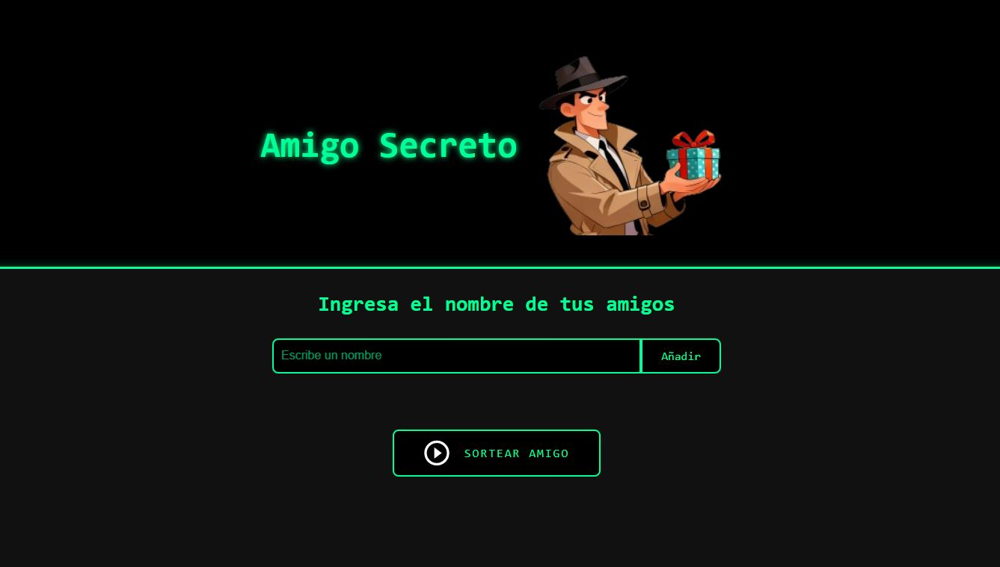

# 🎁 Juego de Amigo Secreto - Challenge Alura LATAM + Oracle Next Education

Este proyecto es una solución al reto del programa **Alura LATAM**, donde se implementa un sencillo pero funcional **juego de Amigo Secreto** usando JavaScript, HTML y CSS.

# 🧠 Descripción

La aplicación permite ingresar nombres de amigos participantes y realizar un sorteo aleatorio para asignar un **amigo secreto**. El objetivo es practicar la manipulación del DOM, arrays y eventos en JavaScript puro, sin frameworks.

# 🚀 Funcionalidades

- ✅ Agregar amigos dinámicamente desde un campo de entrada.
- ✅ Mostrar la lista de amigos ingresados.
- ✅ Validar mínimo 2 y máximo 10 participantes.
- ✅ Sortear aleatoriamente un amigo secreto y mostrarlo en pantalla.
- ⚠️ Previene sorteos si no se cumple con el número permitido.

